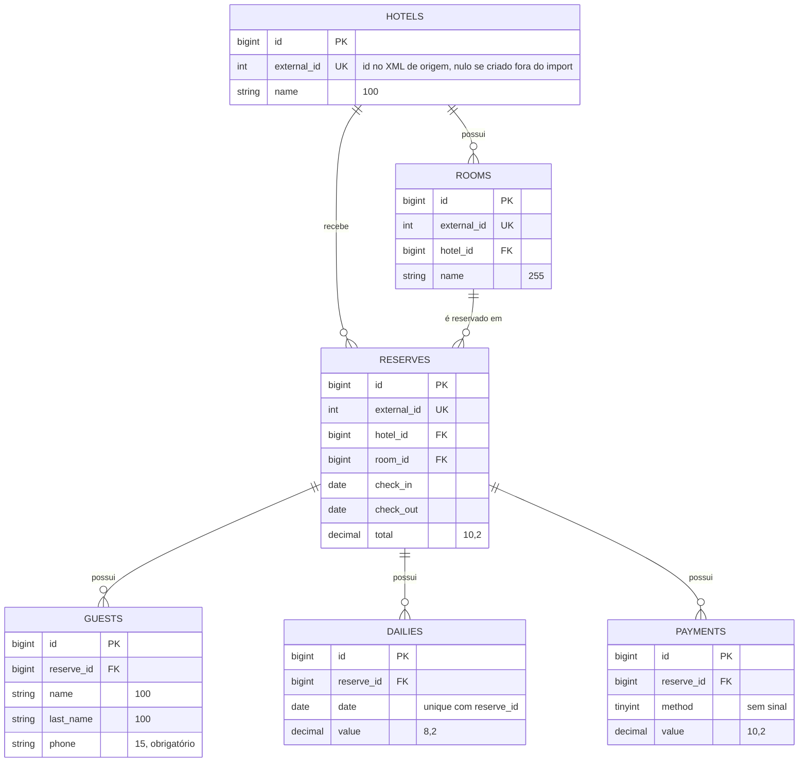

# Modelagem do banco de dados

## Decisões da modelagem

- Valores monetários em `DECIMAL`, para evitar erro de arredondamento do ponto flutuante.
- `guests`, `dailies` e `payments` são tabelas separadas porque o XML traz essas coleções dentro da reserva.
- `dailies` e `payments` pertencem à reserva: um pagamento não está atrelado a uma noite específica.
- `unique(reserve_id, date)` em `dailies` impede duas diárias na mesma noite da mesma reserva.
- Índice em `reserves(room_id, check_in, check_out)` para acelerar a consulta de conflito de datas.
- `external_id` guarda o id do registro no XML de origem, permite que o import rode várias vezes sem duplicar dados (`updateOrCreate`) e é nulo para registros criados pela API.
- Todas as chaves estrangeiras usam `ON DELETE CASCADE`. Por isso a API recusa (409) a remoção de um quarto que tenha reservas, em vez de apagá-las em silêncio.
